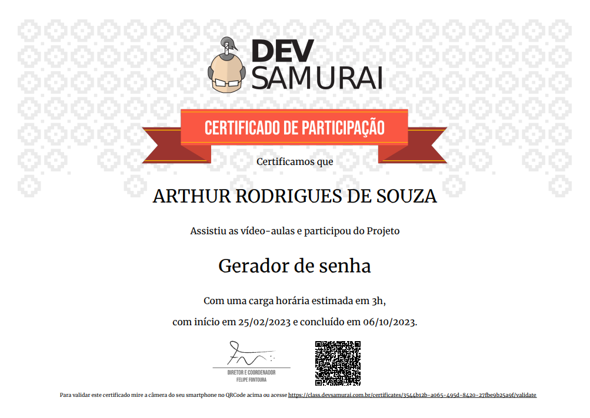

<h1 align="center"> Gerador de senha </h1>

Projeto utilizando JavaScript desenvolvido no curso do Dev Samurai.  

  <a href="#-tecnologias">Tecnologias</a>&nbsp;&nbsp;&nbsp;|&nbsp;&nbsp;&nbsp;
  <a href="#-projeto">Projeto</a>

 

  

## 🚀 Tecnologias

Esse projeto foi desenvolvido com as seguintes tecnologias:

- HTML e CSS
- JavaScript
- Git e Github

## 💻 Projeto

O "Gerador de senha" online é uma aplicação web que oferece uma solução simples e segura para a criação de senhas robustas. Desenvolvido com as mais recentes tecnologias da web, o projeto combina HTML, CSS e JavaScript para proporcionar uma experiência de geração de senhas fácil de usar e altamente personalizável.

- [Acesse meu linkedin.](https://www.linkedin.com/in/arthur-rodrigues-de-souza-6b6b0a258/)

##
